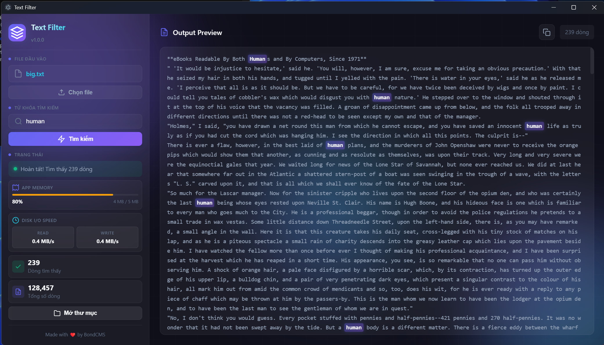

# Text Filter - BondCMS

🔍 **Công cụ lọc từ khóa trong file văn bản hiện đại**

Một ứng dụng Electron mạnh mẽ giúp bạn tìm kiếm và lọc các dòng chứa từ khóa cụ thể trong file văn bản, với giao diện hiện đại và tính năng highlight thông minh.

<!-- Image -->



## ✨ Tính năng nổi bật

### 🎨 Giao diện hiện đại

- **Glassmorphism Design** với backdrop blur và gradient effects
- **Sidebar Layout** tối ưu không gian
- **Responsive Design** với fixed size không cần scroll
- **Dark Theme** với màu sắc hài hòa

### 🔍 Tìm kiếm thông minh

- **Case Insensitive** - Tìm kiếm không phân biệt hoa/thường
- **Keyword Highlighting** - Tự động highlight từ khóa với hiệu ứng glow
- **Real-time Preview** - Hiển thị kết quả ngay trong ứng dụng
- **Statistics** - Thống kê số dòng tìm thấy và tổng số dòng

### 📋 Quản lý kết quả

- **Output Preview** - Xem nội dung đã lọc trực tiếp
- **Copy to Clipboard** - Copy kết quả chỉ với 1 click
- **Open Folder** - Mở thư mục chứa file output
- **Toast Notifications** - Thông báo đẹp mắt và thân thiện

### 🚀 Hiệu suất

- **Stream Processing** - Xử lý file lớn hiệu quả
- **Memory Optimized** - Sử dụng chunks để giảm RAM
- **Fast Search** - Tìm kiếm nhanh với thuật toán tối ưu

## 📸 Screenshots

```
┌─────────────────────────────────────────────────────────────────┐
│  Text Filter v1.0.0                                    □ □ ✕ │
├─────────────────────────────────────────────────────────────────┤
│ ┌─────────────────┐ ┌─────────────────────────────────────────┐ │
│ │ 🔷 Text Filter  │ │ 📄 Output Preview                      │ │
│ │ v1.0.0          │ │ ┌─────────────────────────────────────┐ │ │
│ │                 │ │ │ Line count: 15 dòng                  │ │ │
│ │ 📁 File đầu vào │ │ │ [📋 Copy]                           │ │ │
│ │ ┌─────────────┐ │ │ └─────────────────────────────────────┘ │ │
│ │ │ 📄 file.txt │ │ │ ┌─────────────────────────────────────┐ │ │
│ │ └─────────────┘ │ │ │ <span class="highlight">keyword</span> │ │ │
│ │ [Chọn file]     │ │ │ ...                                 │ │ │
│ │                 │ │ │ ...                                 │ │ │
│ │ 🔍 Từ khóa      │ │ │ ...                                 │ │ │
│ │ ┌─────────────┐ │ │ └─────────────────────────────────────┘ │ │
│ │ │ 🔍 keyword  │ │ └─────────────────────────────────────────┘ │
│ │ └─────────────┘ │                                         │ │
│ │ [Tìm kiếm]      │                                         │ │
│ │                 │                                         │ │
│ │ ✅ Trạng thái    │                                         │ │
│ │ ┌─────────────┐ │                                         │ │
│ │ │ ✅ Hoàn tất │ │                                         │ │
│ │ └─────────────┘ │                                         │ │
│ │ 📊 Thống kê     │                                         │ │
│ │ ┌─────────────┐ │                                         │ │
│ │ │ ✅ 15 dòng  │ │                                         │ │
│ │ │ 📄 100 dòng │ │                                         │ │
│ │ └─────────────┘ │                                         │ │
│ │ [Mở thư mục]    │                                         │ │
│ │                 │                                         │ │
│ │ ❤️ BondCMS      │                                         │ │
│ └─────────────────┘                                         │ │
└─────────────────────────────────────────────────────────────────┘
```

## 🛠️ Cài đặt

### Yêu cầu hệ thống

- **Node.js** 16.0+
- **npm** 7.0+
- **OS**: Windows 10+, macOS 10.14+, Linux

### Cài đặt dependencies

```bash
npm install
```

### Chạy ứng dụng

```bash
# Development mode
npm start

# Build cho production
npm run build
```

## 📖 Hướng dẫn sử dụng

### 1. Chọn file đầu vào

- Click vào nút **"Chọn file"**
- Chọn file văn bản (.txt, .log, .csv, etc.)
- File đã chọn sẽ hiển thị tên

### 2. Nhập từ khóa

- Gõ từ khóa cần tìm vào ô input
- Hỗ trợ các ký tự đặc biệt
- Không phân biệt hoa/thường

### 3. Tìm kiếm

- Click **"Tìm kiếm"** hoặc nhấn Enter
- Progress bar hiển thị khi xử lý
- Kết quả hiển thị ngay trong Output Preview

### 4. Quản lý kết quả

- **Xem preview**: Kết quả được highlight tự động
- **Copy**: Click nút 📋 để copy toàn bộ
- **Mở thư mục**: Click để mở folder chứa output.txt
- **Thống kê**: Xem số dòng tìm thấy/tổng số

## 🏗️ Cấu trúc dự án

```
bondcms-project/
├── 📄 index.html          # Main UI structure
├── 🎨 styles.css          # Modern glassmorphism styling
├── ⚡ main.js             # Electron main process
├── 🎮 renderer.js         # UI logic & interactions
├── 🔌 preload.js          # Secure IPC bridge
├── 📦 package.json        # Dependencies & scripts
├── 📖 README.md           # This file
└── 📁 dist/               # Built application
```

## 🧩 Technologies

### Core Technologies

- **Electron** - Desktop app framework
- **Node.js** - Backend runtime
- **HTML5/CSS3/JS** - Frontend stack

### Key Features

- **Context Isolation** - Security best practices
- **Stream Processing** - File handling optimization
- **Glassmorphism UI** - Modern design system
- **Toast Notifications** - User feedback system

## 🔧 Development

### Scripts

```json
{
  "start": "electron .",
  "build": "electron-builder",
  "dev": "electron . --dev"
}
```

### Build Configuration

- **Platform**: Windows, macOS, Linux
- **Architecture**: x64, arm64
- **Output**: `dist/` directory

## 📝 Changelog

### v1.0.0 (2025-12-30)

- ✨ Initial release
- 🎨 Modern glassmorphism UI
- 🔍 Keyword highlighting
- 📋 Copy to clipboard
- 🎭 Toast notifications
- 📊 Real-time statistics

## 🤝 Đóng góp

1. Fork dự án
2. Tạo feature branch (`git checkout -b feature/AmazingFeature`)
3. Commit changes (`git commit -m 'Add some AmazingFeature'`)
4. Push to branch (`git push origin feature/AmazingFeature`)
5. Open Pull Request

## 📄 License

Dự án này được phát triển bởi **BaoCMS** - BondCMS Team

## 📞 Liên hệ

- **Author**: BaoCMS
- **Project**: Text Filter - BondCMS
- **Version**: 1.0.0

---

⭐ Nếu bạn thích dự án này, hãy cho một star!

Made with ❤️ by BaoCMS | BondCMS Team
